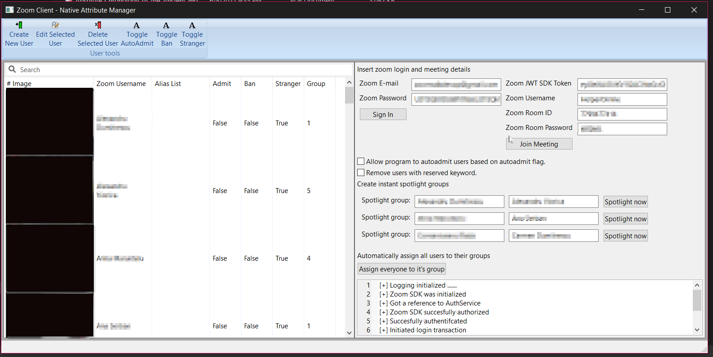

# zoom-autoadmit-meeting-extension-pub
A tool for Zoom that helps manage meetings.

# Interface

# What can it do
- User list with required attributes
- Zoom login manager (old sdk)
- Spotlight multiple users at once
- Create/organize rooms and insert users into specific rooms automatically - based on user data tags